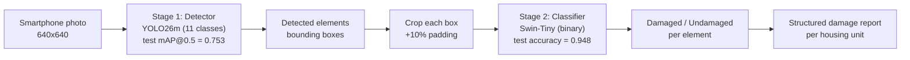
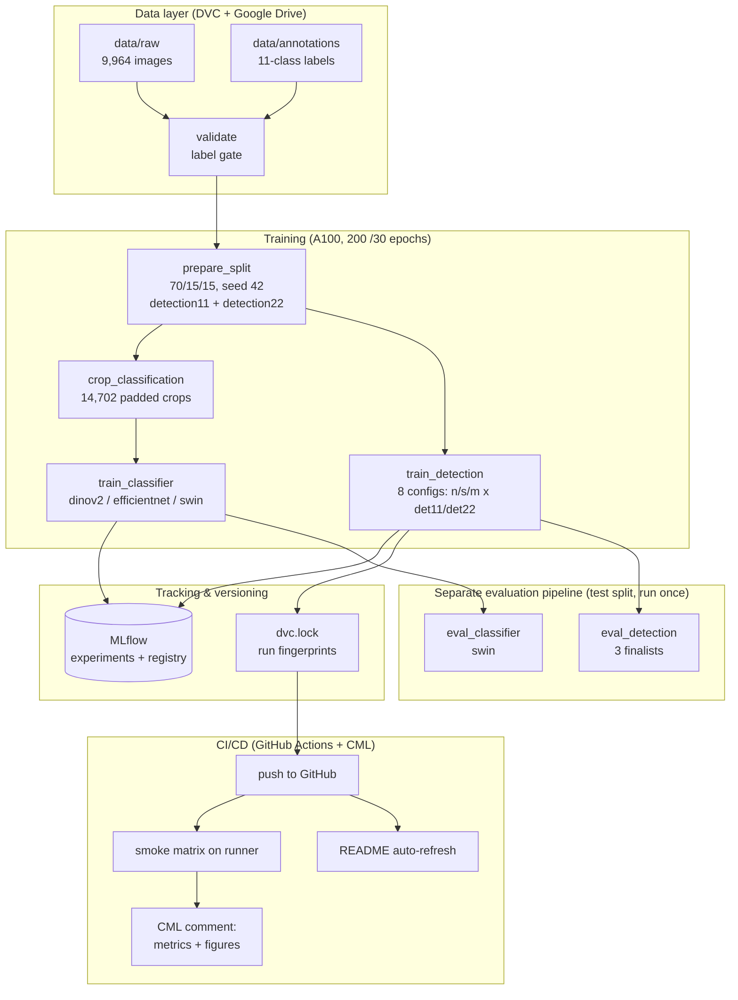
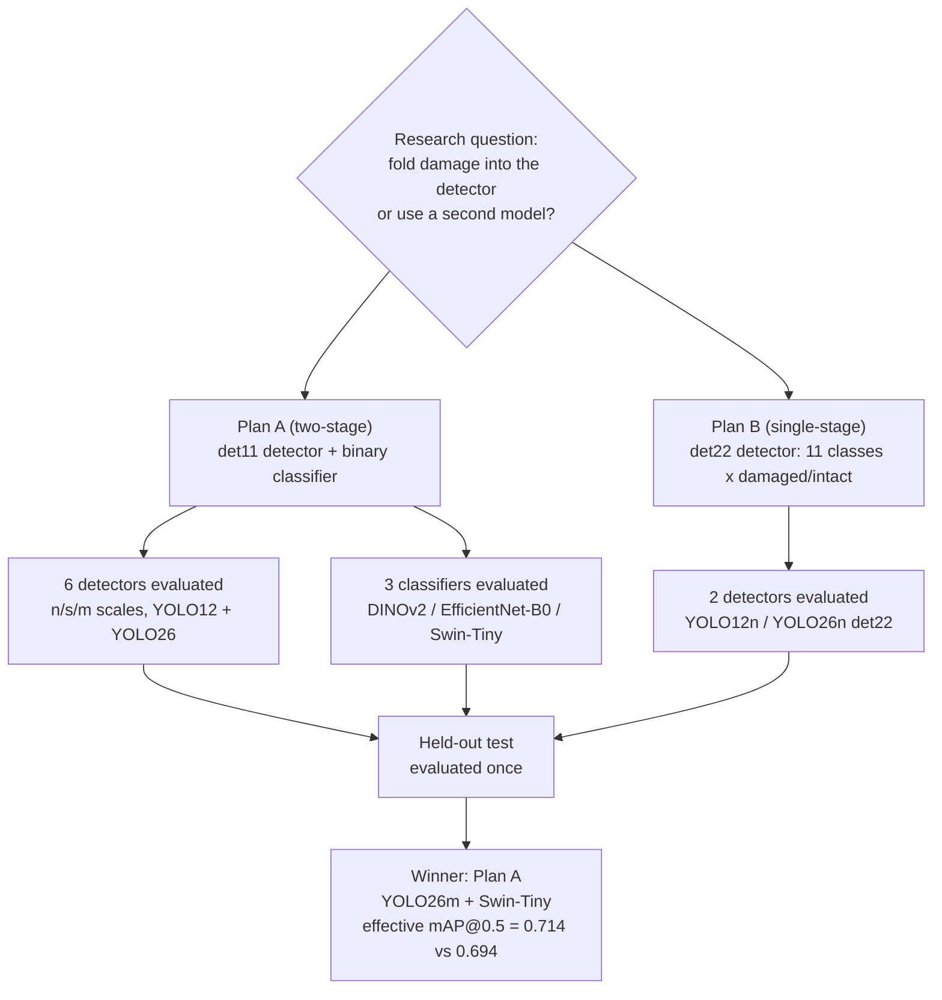
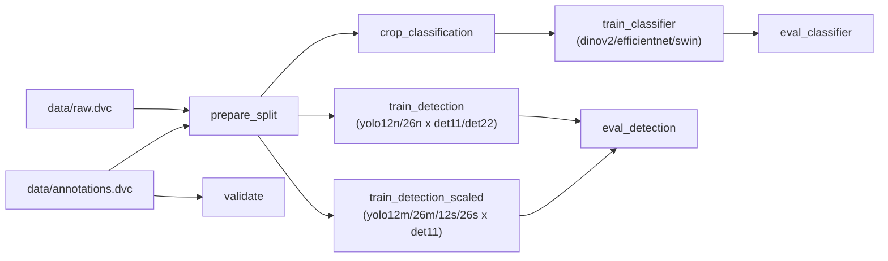

# Workflow diagrams (Mermaid sources — render at mermaid.live or in any
# Markdown viewer, export as PNG/SVG for the dissertation)

## D1 — Two-stage inference system (Plan A, the recommended design)

## D2 — MLOps pipeline (as implemented)

## D3 — Experiment design (what was compared)

## D4 — DVC dependency graph (simplified from `dvc dag`)

The full ASCII DAG is in `dvc_dag.txt` (output of `dvc dag`).
