# War Damage Assessment — Approach Comparison Report

**Status: FINAL** — covers every completed run of the experiment matrix:
six detection models on the base scheme, two on the damage-encoded scheme,
and three damage classifiers. Nano models and classifiers trained 2026-08-13
(Pod 1); small/medium models trained 2026-08-14 (Pod 2).

- **Dataset:** 9,964 image/label pairs, 14,702 annotated objects, 11 classes,
  deterministic 70/15/15 split (seed 42) — see `reports/split_manifest.json`.
- **Hardware:** NVIDIA A100-SXM4-80GB. Detection: 200 epochs each.
  Classifiers: 30 epochs each on 14,702 padded crops.
- **Tracking:** MLflow experiments `war-damage-detection` and
  `war-damage-classification` (databases versioned as `mlflow_pod1.db.dvc` /
  `mlflow_pod2.db.dvc`); pipeline fingerprint in `dvc.lock`.

## The two competing designs

| | Plan A — two-stage | Plan B — single-stage |
|---|---|---|
| Detection | 11 base classes (det11) | 22 classes = 11 × {intact, damaged} (det22, `new_cls = cls + 11 · damage_flag`) |
| Damage decision | dedicated crop classifier | folded into the detector |
| Components to deploy | 2 models | 1 model |

## Detection results (200 epochs, full data)

| model · scheme | mAP50 | mAP50-95 | precision | recall | F1¹ | train time² |
|---|---|---|---|---|---|---|
| **yolo12m · det11** | **0.750** | 0.488 | 0.804 | **0.695** | 0.746 | 4 h 22 m |
| yolo26m · det11 | 0.738 | **0.490** | **0.814** | 0.693 | **0.748** | 3 h 58 m |
| yolo12s · det11 | 0.738 | 0.483 | 0.768 | 0.687 | 0.725 | 3 h 05 m |
| yolo26s · det11 | 0.733 | 0.486 | 0.801 | 0.685 | 0.738 | 3 h 06 m |
| yolo12n · det11 | 0.725 | 0.474 | 0.784 | 0.689 | 0.734 | 2 h 33 m |
| yolo26n · det11 | 0.721 | 0.467 | 0.754 | 0.684 | 0.717 | 2 h 40 m |
| yolo26n · det22 | 0.669 | 0.435 | 0.732 | 0.633 | 0.679 | 2 h 38 m |
| yolo12n · det22 | 0.668 | 0.432 | 0.741 | 0.617 | 0.674 | 2 h 32 m |

¹ F1 derived as 2·P·R / (P+R) from final validation precision/recall.
² Ultralytics cumulative training clock (`results.csv`); MLflow wall-clock
runs 1–3 % higher (setup + validation + artifact logging).

### What scale bought

- **yolo12 leads on mAP50 at every scale** (n 0.725 → s 0.738 → m 0.750);
  each size step adds roughly +0.012 mAP50 for ~21–42 % more training time
  per step.
- **yolo26 catches up with size**: at nano it trails yolo12 on every det11
  metric, but
  **yolo26m takes best mAP50-95 (0.490), best precision (0.814), and best
  F1 (0.748)** — the architecture pays off at medium scale, favoring
  localization quality and fewer false positives over raw mAP50.
- The s-models are the efficiency sweet spot: ~98 % of medium-scale mAP50
  for roughly three-quarters of the training time (72–78 %).
- det22 was trained at nano scale only (see caveats): both nano runs show a
  consistent scheme penalty of −0.052 to −0.057 mAP50 (−7.2 % to −7.8 %
  relative) versus their det11 twins.

## Classifier results (30 epochs, damaged/undamaged crops — Pod 1)

| model | backbone | F1 (damaged) | accuracy | best epoch | train time³ |
|---|---|---|---|---|---|
| **swin** | swin_tiny_patch4_window7_224 | **0.956** | **0.958** | 19 | 9 m 56 s |
| efficientnet | efficientnet_b0 | 0.942 | 0.946 | 25 | 9 m 36 s |
| dinov2 | vit_small_patch14_dinov2.lvd142m | 0.863 | 0.872 | 28 | 9 m 29 s |

³ Wall-clock durations from MLflow run records.

Swin-Tiny leads on F1, accuracy, and damaged-class recall; EfficientNet-B0
is marginally ahead on damaged-class precision (0.957 vs 0.955). DINOv2's
frozen-feature pedigree did not translate into an advantage under identical
fine-tuning conditions.

## Central analysis — Plan A vs Plan B (final)

Plan A's end-to-end quality is approximately the det11 detector's quality
degraded by the classifier's error rate (every detected box is re-judged by
the classifier):

- **Plan A (yolo12m-det11 + swin):** effective mAP50 ≈ 0.750 × 0.958 =
  **0.718**; effective recall ≈ 0.695 × 0.958 = **0.666**.
- **Plan B (best measured, yolo26n-det22):** mAP50 = **0.669**,
  recall = 0.633.

**Break-even:** Plan A beats Plan B whenever classifier accuracy exceeds the
det22/det11 quality ratio. Against the strongest det11 detector that
threshold is 0.669 / 0.750 = **89.3 %** (computed on unrounded metrics) —
Swin's measured 95.8 % clears it
by 6.5 points. The margin *grew* with detector scale: +0.025 effective mAP50
at nano (interim report) → **+0.049 (+7.3 % relative) at medium**.

**Final verdict: Plan A — yolo12m-det11 detection + Swin-Tiny damage
classification.** It wins on every effective-quality measure, and its
advantage widened as detectors improved, because better detection compounds
through the classifier while the single-stage scheme pays its class-splitting
penalty at any scale.

Plan B retains its deployment virtues — one model, one inference pass,
simpler failure analysis — and remains a reasonable choice where
integration simplicity outweighs ~5 points of effective mAP50.

Caveats, stated honestly:
- det22 was never trained at s/m scale. Extrapolating yolo12's measured nano
  penalty (−7.8 % relative) onto yolo12m suggests a hypothetical
  yolo12m-det22 near **0.69 mAP50** — still below Plan A's 0.718, but this
  is an estimate, not a measurement.
- The effective-quality product treats classifier errors as uniform across
  classes and ignores localization interplay; det22 aggregate recall is not
  its damaged-classes-only recall. A per-class error analysis on the held-out
  test split is the recommended next step before deployment.

## Figures

### Recommended pipeline — yolo12m · det11 (best mAP50)
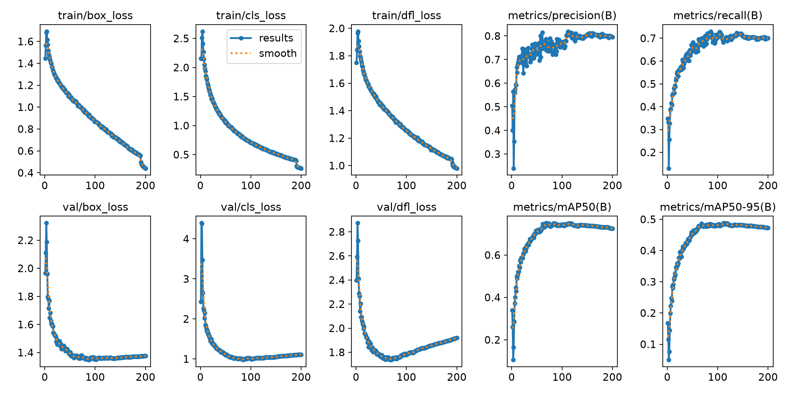
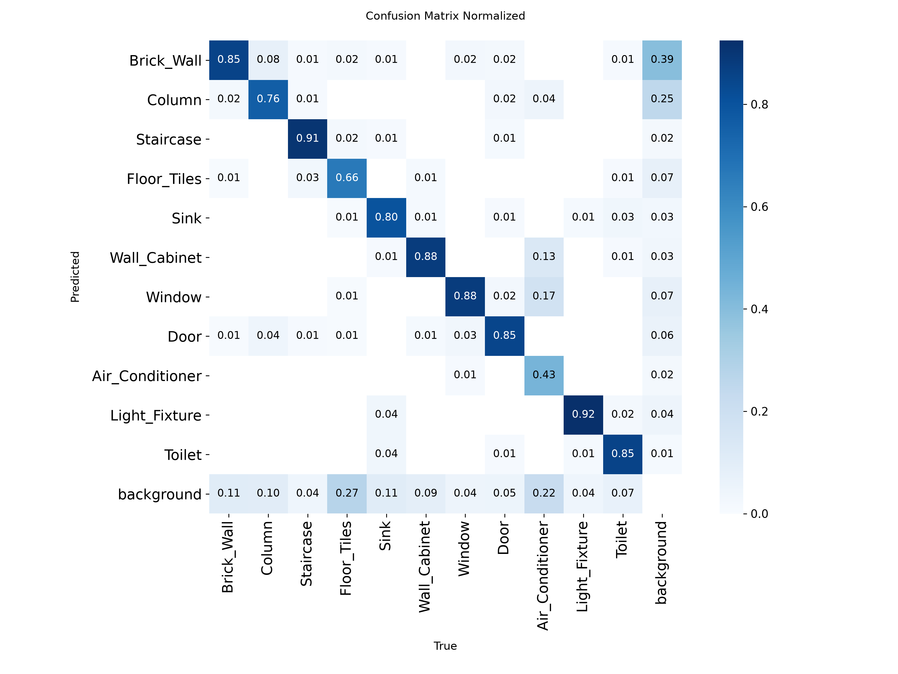
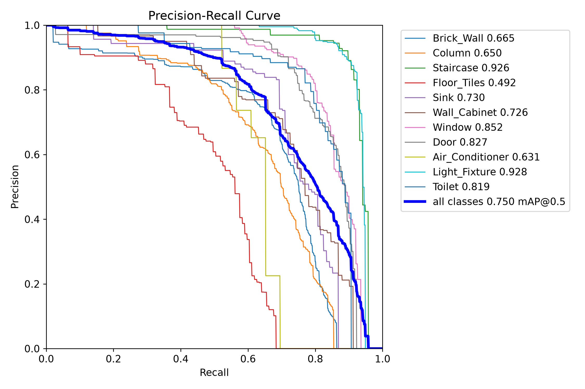
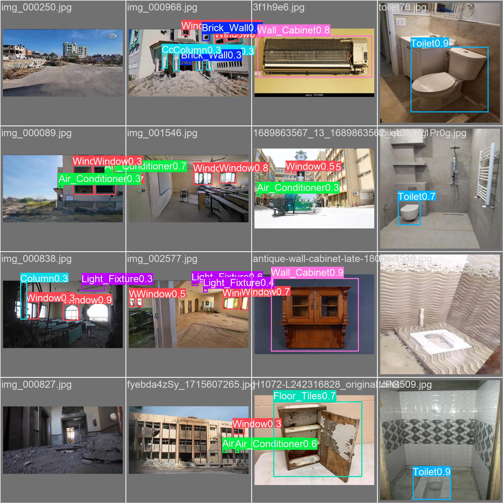

### Runner-up — yolo26m · det11 (best mAP50-95, precision, F1)
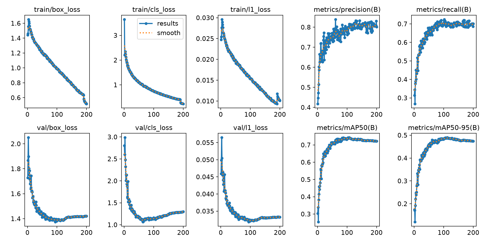
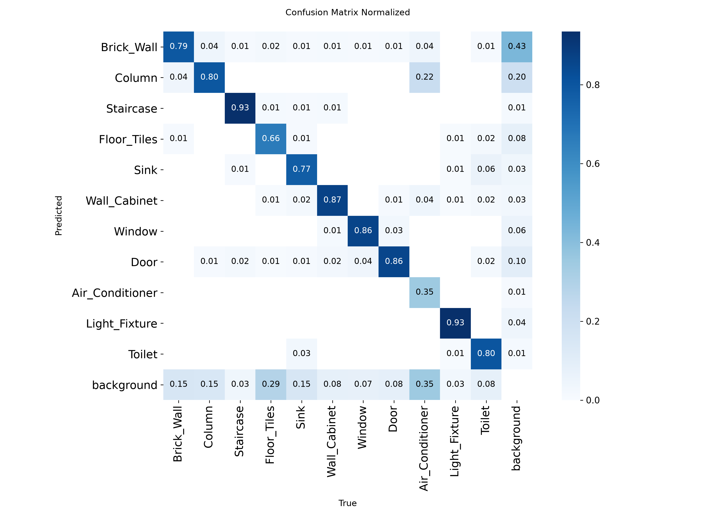

### Best single-stage — yolo26n · det22
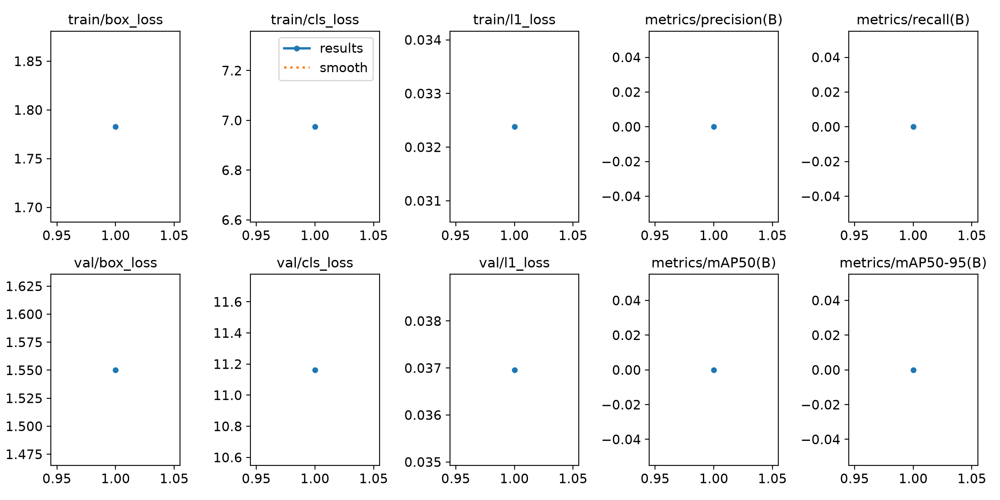
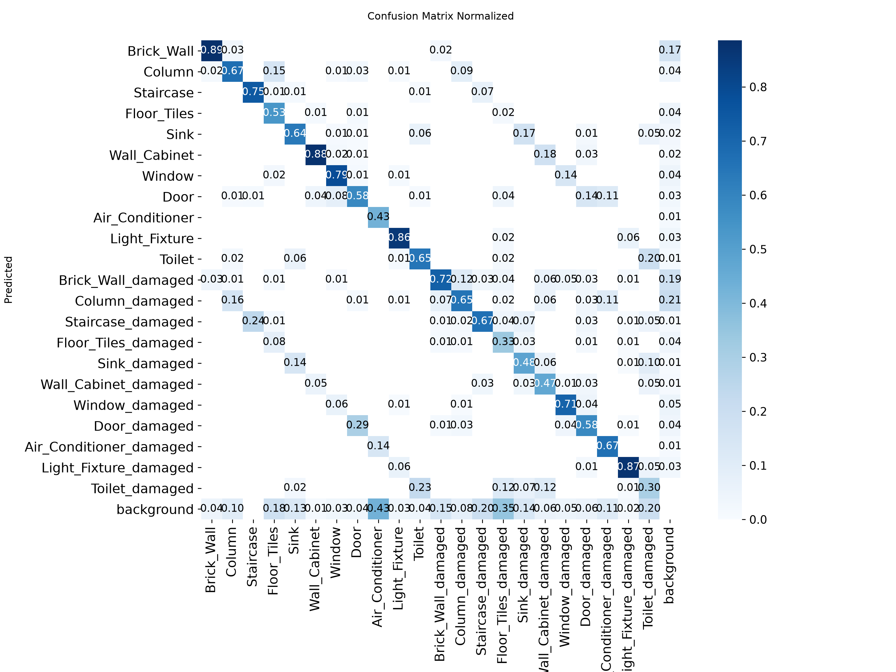

### Recommended classifier — swin
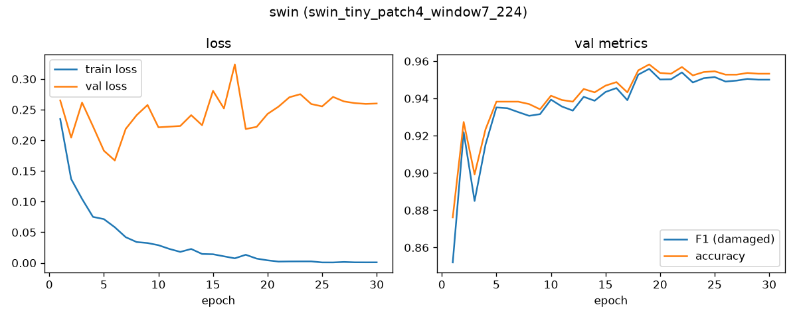
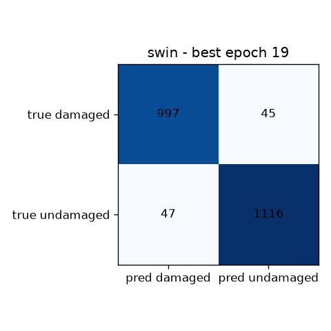

### Full figure index (all runs)

| run | curves | confusion | PR curve | predictions |
|---|---|---|---|---|
| yolo12m·11 | [results](figures/yolo12m_11/results.png) | [matrix](figures/yolo12m_11/confusion_matrix_normalized.png) | [PR](figures/yolo12m_11/BoxPR_curve.png) | [val](figures/yolo12m_11/val_batch0_pred.jpg) |
| yolo26m·11 | [results](figures/yolo26m_11/results.png) | [matrix](figures/yolo26m_11/confusion_matrix_normalized.png) | [PR](figures/yolo26m_11/BoxPR_curve.png) | [val](figures/yolo26m_11/val_batch0_pred.jpg) |
| yolo12s·11 | [results](figures/yolo12s_11/results.png) | [matrix](figures/yolo12s_11/confusion_matrix_normalized.png) | [PR](figures/yolo12s_11/BoxPR_curve.png) | [val](figures/yolo12s_11/val_batch0_pred.jpg) |
| yolo26s·11 | [results](figures/yolo26s_11/results.png) | [matrix](figures/yolo26s_11/confusion_matrix_normalized.png) | [PR](figures/yolo26s_11/BoxPR_curve.png) | [val](figures/yolo26s_11/val_batch0_pred.jpg) |
| yolo12n·11 | [results](figures/yolo12n_11/results.png) | [matrix](figures/yolo12n_11/confusion_matrix_normalized.png) | [PR](figures/yolo12n_11/BoxPR_curve.png) | [val](figures/yolo12n_11/val_batch0_pred.jpg) |
| yolo26n·11 | [results](figures/yolo26n_11/results.png) | [matrix](figures/yolo26n_11/confusion_matrix_normalized.png) | [PR](figures/yolo26n_11/BoxPR_curve.png) | [val](figures/yolo26n_11/val_batch0_pred.jpg) |
| yolo12n·22 | [results](figures/yolo12n_22/results.png) | [matrix](figures/yolo12n_22/confusion_matrix_normalized.png) | [PR](figures/yolo12n_22/BoxPR_curve.png) | [val](figures/yolo12n_22/val_batch0_pred.jpg) |
| yolo26n·22 | [results](figures/yolo26n_22/results.png) | [matrix](figures/yolo26n_22/confusion_matrix_normalized.png) | [PR](figures/yolo26n_22/BoxPR_curve.png) | [val](figures/yolo26n_22/val_batch0_pred.jpg) |
| cls swin | [results](figures/cls_swin/results.png) | [matrix](figures/cls_swin/confusion_matrix.png) | — | — |
| cls efficientnet | [results](figures/cls_efficientnet/results.png) | [matrix](figures/cls_efficientnet/confusion_matrix.png) | — | — |
| cls dinov2 | [results](figures/cls_dinov2/results.png) | [matrix](figures/cls_dinov2/confusion_matrix.png) | — | — |

## Test-split results (held-out, evaluated once)

The 70/15/15 split's **test set** (1,495 images, 2,233 objects / crops) was
never touched during training or model selection. The finalists were
evaluated on it exactly once, via the separate evaluation pipeline
(`evaluation/dvc.yaml`, MLflow experiment `war-damage-test-eval`):

| finalist | mAP50 | mAP50-95 | precision | recall | F1 |
|---|---|---|---|---|---|
| **yolo26m · det11** | **0.753** | **0.491** | **0.812** | 0.709 | **0.757** |
| yolo12m · det11 | 0.750 | 0.482 | 0.751 | **0.725** | 0.738 |
| yolo26n · det22 | 0.694 | 0.456 | 0.756 | 0.659 | 0.704 |

| classifier | crops | accuracy | precision (damaged) | recall (damaged) | F1 (damaged) |
|---|---|---|---|---|---|
| swin | 2,233 | 0.948 | 0.938 | 0.952 | 0.945 |

What the held-out set changed:

- **The detector ranking flips**: yolo26m edges yolo12m on test mAP50
  (0.753 vs 0.750 — within noise) and wins clearly on precision (+0.061)
  and F1 (+0.019). Combined with its val-split wins on mAP50-95 and
  precision, **yolo26m-det11 is the better deployment detector**.
- **Plan B generalized better than validation suggested**: yolo26n-det22
  scored 0.694 on test vs 0.669 on val, while Swin came in slightly under
  its val accuracy (0.948 vs 0.958). The honest final margin is therefore
  narrower: Plan A effective test mAP50 ≈ 0.753 × 0.948 = **0.714** vs
  Plan B's measured **0.694** — **+0.020 (+2.8 % relative)**, not the
  +0.049 the validation numbers implied. Test break-even: 0.694 / 0.753 =
  92.2 %; Swin's 94.8 % clears it by 2.6 points.
- **Plan A still wins on quality** — on both splits, independently — but
  the gap is modest, which strengthens the case for Plan B in deployments
  where single-model simplicity matters.

Per-class test AP50 of the recommended detector (yolo26m · det11):

| class | AP50 | P | R | | class | AP50 | P | R |
|---|---|---|---|---|---|---|---|---|
| Staircase | 0.933 | 0.915 | 0.866 | | Sink | 0.684 | 0.807 | 0.630 |
| Toilet | 0.915 | 0.879 | 0.836 | | Column | 0.655 | 0.733 | 0.645 |
| Light_Fixture | 0.888 | 0.913 | 0.848 | | Floor_Tiles | 0.647 | 0.711 | 0.647 |
| Door | 0.835 | 0.901 | 0.787 | | Wall_Cabinet | 0.643 | 0.719 | 0.594 |
| Window | 0.823 | 0.846 | 0.770 | | Air_Conditioner | 0.633 | 0.766 | 0.583 |
| | | | | | Brick_Wall | 0.623 | 0.736 | 0.589 |

Fixtures with distinctive shapes (staircases, toilets, light fixtures) detect
excellently; large diffuse or under-represented classes (brick walls, wall
cabinets, air conditioners) are the improvement targets — more training data
for those classes would move the needle most.

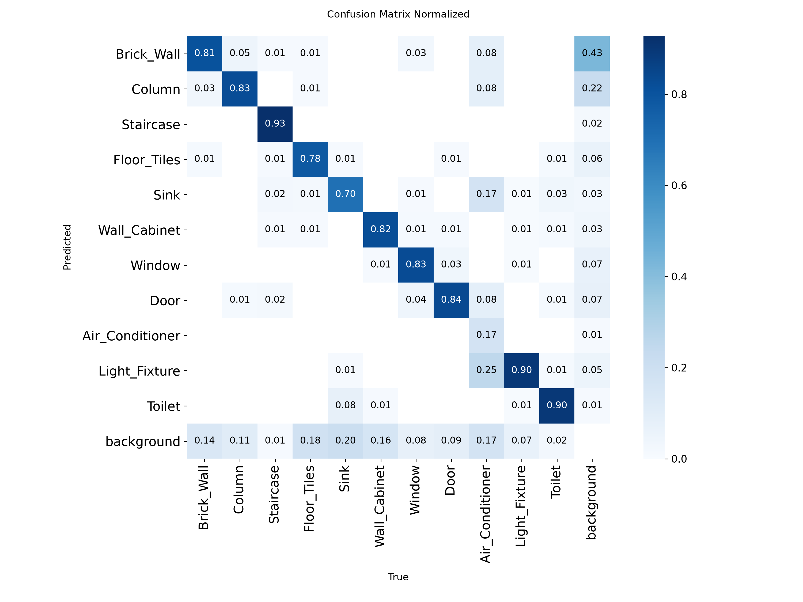
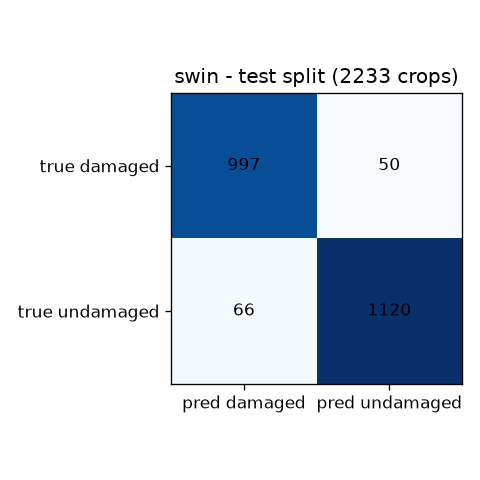

## Conclusion & recommendation

Deploy **Plan A: yolo26m-det11 + Swin-Tiny** — the held-out test evaluation
(the deciding evidence) puts it first on mAP50, mAP50-95, precision, and F1,
with an effective test mAP50 of ≈ 0.714 vs 0.694 for the best single-stage
model. yolo12m-det11 is a near-tie on mAP50 with better recall — a valid
alternative where missed detections cost more than false positives. Where
inference cost dominates, the s-scale detectors deliver ~98 % of the quality
at a fraction of the compute. Remaining follow-ups: targeted data collection
for the weak classes (Brick_Wall, Wall_Cabinet, Air_Conditioner), and — only
if Plan B must be revisited — a single m-scale det22 run to replace the
extrapolated caveat with a measurement.

Note on provenance: Pod 2 also re-ran the three classifiers as part of its
pipeline; those near-duplicate runs were deliberately not merged — the
published classifier results and registered models remain Pod 1's canonical
runs.

---
*Generated from: `reports/metrics_*.json` (8 detection + 3 classifier runs),
`runs_detection/*/results.csv`, MLflow run records (`mlflow_pod1.db`,
`mlflow_pod2.db`). Weights and databases versioned in DVC; run fingerprints
in `dvc.lock`.*
