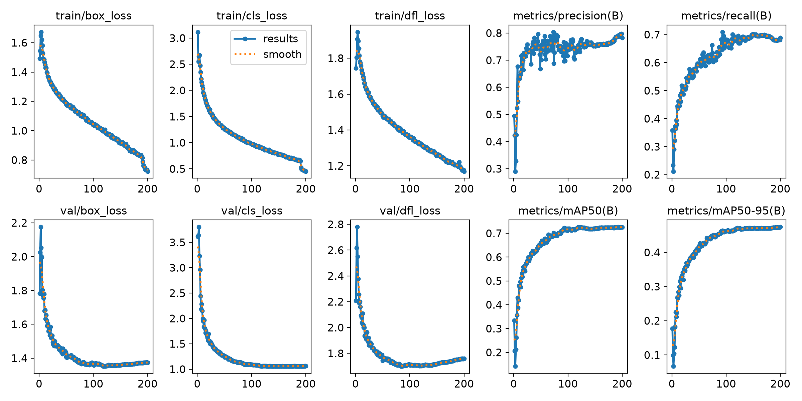
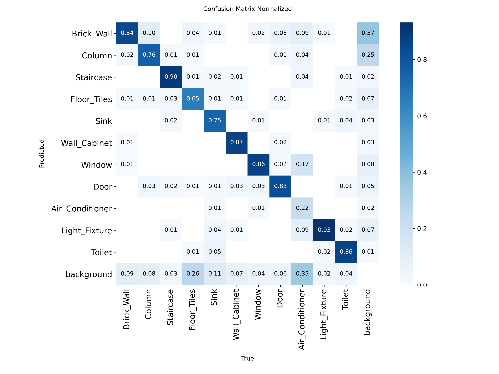
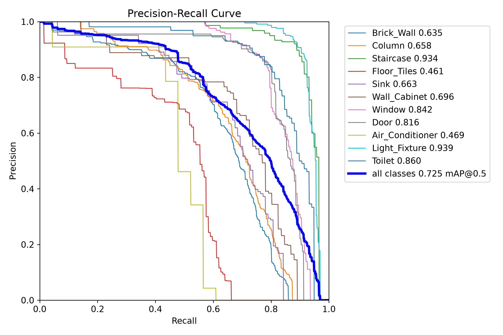

# War Damage Assessment — Approach Comparison Report

**Status: INTERIM** — this report covers the nano-scale detection models and all three
damage classifiers (Pod 1, completed 2026-08-13). Larger detection models
(yolo12m / yolo26m / yolo12s / yolo26s) are still training and will be added in a
follow-up revision — see [Pending results](#pending-results).

- **Dataset:** 9,964 image/label pairs, 14,702 annotated objects, 11 classes,
  deterministic 70/15/15 split (seed 42) — see `reports/split_manifest.json`.
- **Hardware:** NVIDIA A100-SXM4-80GB. Detection: 200 epochs each.
  Classifiers: 30 epochs each on 14,702 padded crops.
- **Tracking:** MLflow experiments `war-damage-detection` and
  `war-damage-classification`; pipeline fingerprint in `dvc.lock`.

## The two competing designs

| | Plan A — two-stage | Plan B — single-stage |
|---|---|---|
| Detection | 11 base classes (det11) | 22 classes = 11 × {intact, damaged} (det22, `new_cls = cls + 11 · damage_flag`) |
| Damage decision | dedicated crop classifier | folded into the detector |
| Components to deploy | 2 models | 1 model |

## Detection results (200 epochs, full data)

| model · scheme | mAP50 | mAP50-95 | precision | recall | F1¹ | train time |
|---|---|---|---|---|---|---|
| **yolo12n · det11** | **0.725** | **0.474** | 0.784 | 0.689 | **0.734** | 2 h 33 m |
| yolo26n · det11 | 0.721 | 0.467 | 0.754 | 0.684 | 0.717 | 2 h 40 m |
| yolo26n · det22 | 0.669 | 0.435 | 0.732 | 0.633 | 0.679 | 2 h 38 m |
| yolo12n · det22 | 0.668 | 0.432 | 0.741 | 0.617 | 0.674 | 2 h 32 m |

¹ F1 derived as 2·P·R / (P+R) from the final validation precision/recall.

Observations:

- **yolo12n outperforms yolo26n on both schemes** at nano scale (and trains
  slightly faster) — the newer architecture shows no advantage here yet.
- The damage-encoded scheme costs **−0.052 to −0.057 mAP50 (−7.2 % to −7.8 %
  relative)** depending on the model: halving the per-class examples while
  doubling the classes measurably hurts the detector.

## Classifier results (30 epochs, damaged/undamaged crops)

| model | backbone | F1 (damaged) | accuracy | best epoch | train time² |
|---|---|---|---|---|---|
| **swin** | swin_tiny_patch4_window7_224 | **0.956** | **0.958** | 19 | 9 m 56 s |
| efficientnet | efficientnet_b0 | 0.942 | 0.946 | 25 | 9 m 36 s |
| dinov2 | vit_small_patch14_dinov2.lvd142m | 0.863 | 0.872 | 28 | 9 m 29 s |

² Wall-clock durations from MLflow run records; detection times above are
ultralytics' cumulative training clock from `results.csv`.

Swin-Tiny leads on F1, accuracy, and damaged-class recall; EfficientNet-B0 is
marginally ahead on damaged-class precision (0.957 vs 0.955). DINOv2's
frozen-feature pedigree did not translate into an advantage under identical
fine-tuning conditions.

## Central analysis — Plan A vs Plan B

Plan A's end-to-end quality is approximately the det11 detector's quality
degraded by the classifier's error rate (every detected box is re-judged by the
classifier):

- **Plan A (yolo12n-det11 + swin):** effective mAP50 ≈ 0.725 × 0.958 = **0.695**;
  effective recall ≈ 0.689 × 0.958 = **0.660**.
- **Plan B (best det22 = yolo26n):** mAP50 = **0.669**, recall = **0.633**.

**Break-even:** Plan A beats Plan B whenever the classifier's accuracy exceeds
the det22/det11 quality ratio. On the measured numbers that threshold is
**0.669 / 0.725 = 92.3 %**. During planning we assumed a stricter ~96 %
break-even; Swin's measured 95.8 % sits marginally below that conservative
threshold but clears the *actual* one with a comfortable margin, because the
det22 penalty (−7.7 %) turned out larger than the planning assumption.

**Verdict on Pod 1 evidence: Plan A (det11 + Swin) wins** — +0.025 effective
mAP50 (+3.8 % relative, computed from unrounded values) and +0.027 effective
recall over the best single-stage model. Plan B retains real non-quality advantages: one model to
deploy, one inference pass (no crop batching), simpler failure analysis. If the
quality gap narrows at larger model scales, simplicity may justify Plan B —
that is exactly what the pending m/s runs will decide.

Caveats: the effective-quality product is an approximation (it treats
classifier errors as uniform across classes and ignores localization
interplay); det22 aggregate recall is not the damaged-classes-only recall. A
per-class error analysis on the test split is recommended before the final
verdict.

## Figures

### Best detector — yolo12n · det11

### Best single-stage — yolo26n · det22

### Best classifier — swin

Remaining runs: `figures/yolo26n_11/`, `figures/yolo12n_22/`,
`figures/cls_efficientnet/`, `figures/cls_dinov2/`.

## Conclusion & recommendation (interim)

On completed evidence, the two-stage design — **yolo12n-det11 detection +
Swin-Tiny damage classification** — is the recommended configuration: best
detector, best classifier, and an effective-quality margin over every
single-stage alternative. The recommendation is **interim**: nano-scale
detectors may under-represent what single-stage training can absorb, and the
break-even arithmetic could shift at higher capacity.

## Pending results

Currently training (larger detection models, det11 scheme, 200 epochs):

- yolo12m, yolo26m (medium)
- yolo12s, yolo26s (small)

A follow-up revision will extend the matrix, re-run the break-even analysis at
each scale, and issue the final verdict.

---
*Generated from Pod 1 artifacts: `reports/metrics_*.json`,
`runs_detection/*/results.csv`, MLflow run records (`mlflow.db`). Pipeline
state: `dvc.lock` at 200-epoch configuration, `params.yaml` epochs=200.*
